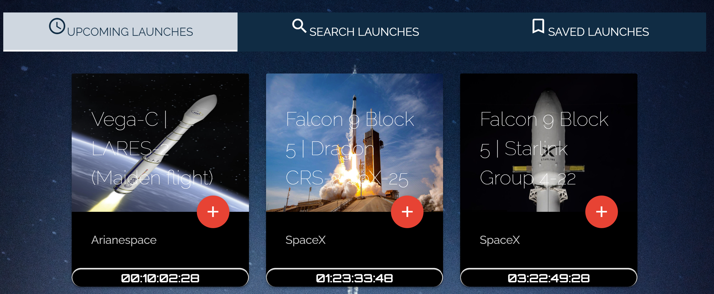
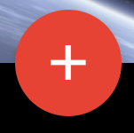
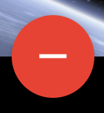
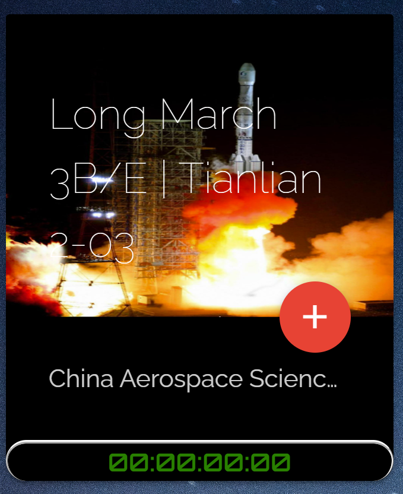
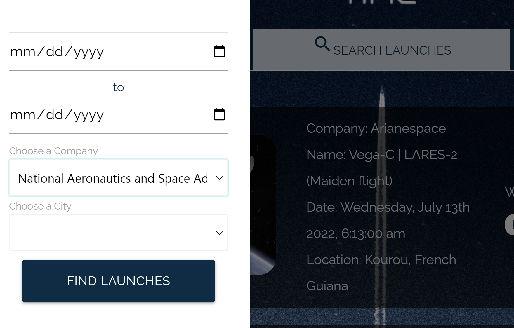

# WeatherLaunch
[Live Website hosted @ GitHub Pages](https://thetruemop.github.io/Launch-Time/)

UT-Bootcamp Project 1 Group 3:
- Dawson
- Itzel
- Dustin
- Austin

## Project Purpose
This project was intended to reinforce HTML CSS and Javascript knowledge, while also introducing FETCH calls to APIs for data retrieval and utilization of that data on the front end.

## Technologies Utilized
- HTML
- CSS
- Materialize
- Javascript
- Moment.js
- Axios
- APIs
    - Visual Crossing Weather API
    - The SpaceDevs Launch API

## Landing Page

### General Use
- The Upcoming Launches page features the next 100 launches known to this API. The cards display the missions name, launcher service provider, and the time until the launch is scheduled.

    - 

- Click the missions title and/or image to open a MODAL with lots more information about the mission, agency, rocket... all kinds of stuff!
    - 

- You can use the "+" sign button to ADD this card to the SAVED MISSIONS page if you'd like to keep track of it.

    - 
- Once added, you can use the "-" sign to remove it from your Saved Missions list.

    - 
- If the Mission Timer is green, the launch timer has reached 00:00:00:00 and the mission is presumably launched.

    - 

- The Search Launches page will allow you to filter the UPCOMING LAUNCHES by DATE RANGE, LAUNCH SERVICE PROVIDER, or a city where launch pads exist. Additionally, in the case of launches LESS THAN 15 days in the future, you will also see a weather forecast for launch day. You can also click the "MORE" button here to see the same MODAL from the upcoming pages with more interesting information.

    - 

- Click the magnifying glass icon to OPEN THE SEARCH BAR.
    - 

- The SAVED LAUNCHES page simply holds the cards you've previous selected to saved, and give you them as a specific/smaller list in order to track them.
    - 

